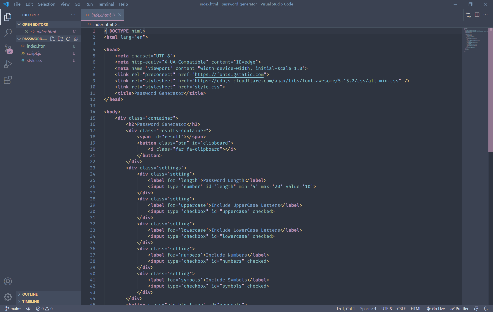
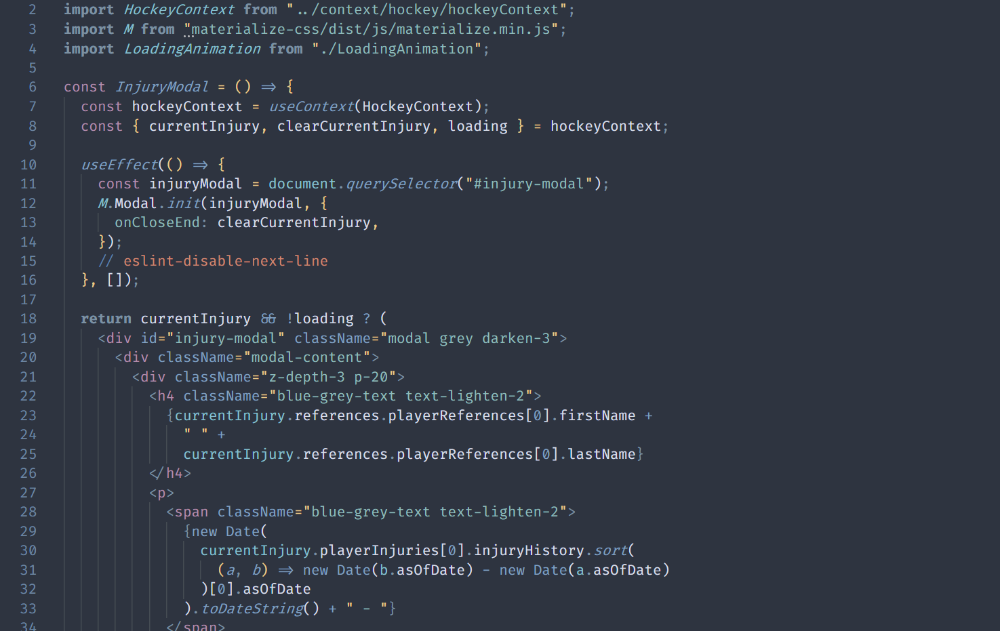
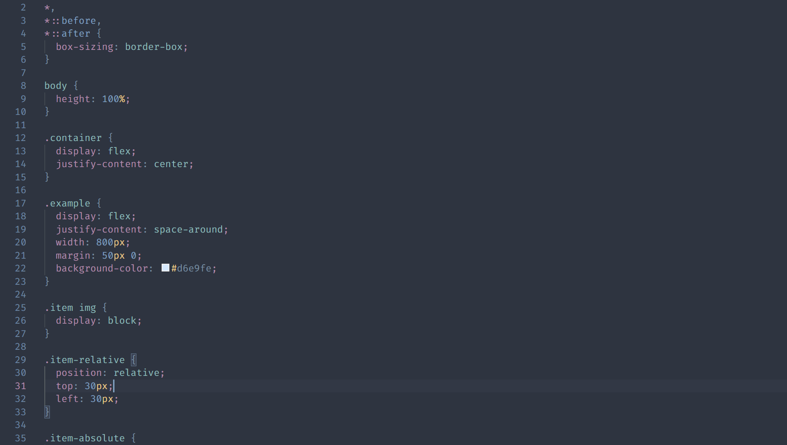

# Nord Theme by Zam

## Theme Specifics
---
- Definitely a work in progress but I am trying my hand at theme creation.
- This theme makes heavy use of the traditional accent colors of the colorway as opposed to being a mostly blue theme.  It won't be for everyone but I am hoping to make at least a few people happy at the end of the day.
- Currently looks pretty good with html, css, and js.
- I have started adding support for python and php.  Other languages will be coming but it will take some time.
- I am still tweaking some of the colors so there will be plenty of changes to come.
- Let me know on GitHub if you have any recommendations or issues and I will do my best to get them implemented/resolved.

## Bracket Pair Colorizer 2
---
- If you are using **Bracket Pair Colorizer 2** for bracket highlighting I would recommend adding the following colors to the settings.json file to compliment the color theme better.  
```json
"bracket-pair-colorizer-2.colors": [
  "#5E81AC",
  "#BE7179",
  "#a3be8c",
  "#d08770"
],
```
## Screen Shots
---
### HTML

---
### JS/React

---
### CSS

